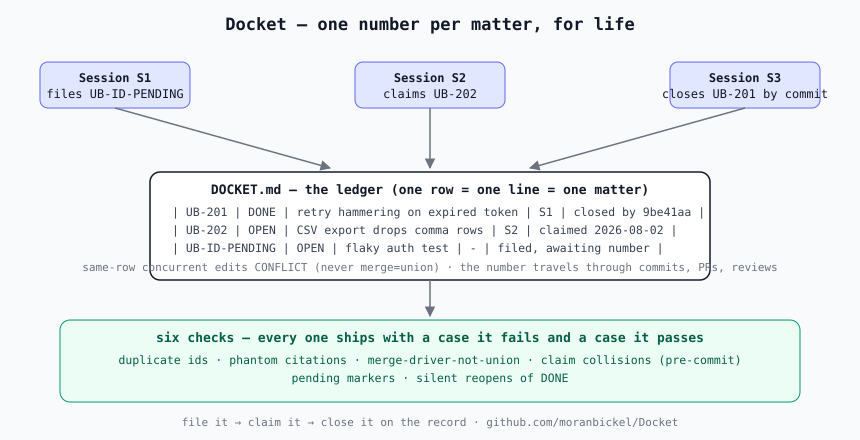

# Docket

**A numbered, in-repo work ledger for concurrent AI coding sessions — file it, claim it, close it on the record. Built for Claude Code / multi-agent workflows.**

<!-- DRAFT-FOR-OPERATOR-EDIT (unedited as of 2026-08-03): the opening paragraph below has NOT yet received the operator's edit. His edited version is canonical; do not polish his edit back. He removes this marker when he makes that edit, before push. -->

I'm a litigator. Every court I've ever worked in runs on a docket: a numbered list of matters, one number per matter, for life. Nobody argues about which case is which. Nobody opens a second file for a case that already has one. When I started running several AI coding sessions against the same repository, I gave them the same thing — one plain-text file where every piece of work gets a number, the number never changes, and everything that happens to that work happens on the record, under that number. This repo is that file, the rules for writing to it, and the checks that keep it honest.

---

## The failure it solves

Two stories, both from the production system this came out of. Both generic here — the pattern is what matters.

**The ledger that quietly duplicated itself for months.** Our ledger file was configured so that when two sessions edited it at the same time, git would merge their edits automatically instead of raising a conflict. That setting is perfect for append-only logs. It is poison for a numbered list, and here is the subtle part: when two sessions each carried an *edit to the same row* and merged, git kept **both copies**. No conflict, no warning, nothing to review. The duplicate count rose **only at merge commits — never at any edit a session actually authored** — so every session looked at its own work and saw a clean file. By the time we noticed, the ledger was salted with duplicated rows, and the tool that was supposed to catch duplicates had been checking something else. One configuration line had turned "two people edited the same row" from a loud conflict into a silent copy-paste machine.

**The work items that never existed.** A session cited item number N as settled authority for a decision. I repeated the citation in an instruction. Neither of us noticed that no item N had ever been filed — the number was plausible, so it passed. Both humans and AIs do this, and prose review will not catch it, because a fabricated number *looks exactly like a real one*. What catches it is arithmetic: the set of numbers ever issued is closed and sits in one file, so "is there a row for N?" is a one-line check a machine can run on every commit. We ran that check backward over our history and found citations to numbers that were never minted — some mine, some the machine's.

The common root: a work ledger is not prose. It is a set of numbered records, and numbered records need the discipline courts figured out long ago — one number per matter, issued once, cited exactly, closed on the record.

---

## The protocol in 60 seconds

- **One file, one line per matter.** Each line starts with its number (`UB-1023`), then a state — `OPEN`, `PARTIAL`, `DONE`, `BLOCKED`, `WONTFIX` — then title, scope, owner, and notes.
- **Numbers are for life.** Never reused, never renumbered. Reopening a `DONE` item requires a written note saying why — regressions reopen loudly, never silently.
- **The number travels.** It appears verbatim in the commit message, the PR title, the review, and the closing note. Finding everything about item 1023 is `git grep UB-1023`.
- **Claims before work.** A session writes itself into the row's owner field before touching the work. A pre-commit check blocks a second claim, which is the defense against the dominant multi-session failure: two sessions building the same thing.
- **Closing cites the work.** A `DONE` row names the commit(s) that closed it. A closure that points at nothing is not a closure.
- **Same-row edits must conflict.** The one git setting that matters: this file must **never** be configured for automatic union merges. If two sessions edit the same row, you want the conflict.



For the full concurrency story — two sessions filing at once, a third claiming, and the same-row edit shown conflicting correctly versus union-merging into silent duplicates — read [`examples/three-sessions-walkthrough.md`](./examples/three-sessions-walkthrough.md).

## Quick start

```bash
# 1. Copy the starter ledger into your repo root
cp templates/DOCKET.md  your-repo/DOCKET.md

# 2. Copy the .gitattributes stanza (it documents the no-union rule at the
#    spot where the next config edit would reintroduce it; CI's merge-driver
#    check is what actually fails the build if union ever resolves)
cat templates/gitattributes-stanza >> your-repo/.gitattributes

# 3. Install the pre-commit checks (duplicate numbers, claim collisions)
bash templates/install-hooks.sh  your-repo

# 4. Add the CI job
cp .github/workflows/ledger-ci.yml  your-repo/.github/workflows/
```

File a matter, claim it, close it:

```
| UB-101 | OPEN | Fix the flaky auth test | symptom | - | - | filed 2026-08-03 |
| UB-101 | OPEN | Fix the flaky auth test | symptom | session-A | - | claimed |
| UB-101 | DONE | Fix the flaky auth test | symptom | session-A | - | closed by commit 4f21c0d |
```

---

## How this relates to the series

This is the file the other protocols stand on. [CSAE](https://github.com/moranbickel/CSAE) registers a session's intent *against a row here*. [Pre-IMPL Forensic Discipline](https://github.com/moranbickel/Pre-IMPL-Forensic-Discipline) checks *a row's premise* before building it. [Peer-Worker Convergence](https://github.com/moranbickel/Peer-Worker-Convergence) converges the branches that carry *row work*. The shared files in [Three-Body Protocol](https://github.com/moranbickel/Three-Body-Protocol) include this one. But the numbering discipline itself — issue once, cite exactly, never duplicate — is this repo's subject, not theirs.

---

## Limits, stated plainly

- **It's a single file.** That is the point (one place to grep, one place to guard), but it means the file is a shared surface for every session.
- **One line per row** trades diff readability for precise conflicts: a row-level edit war shows up as a conflict on exactly that row, at the cost of long lines.
- **There is a practical ceiling.** From measured experience, on the order of a few thousand rows / about a megabyte before you should shard by year or by area.
- **It is not an issue tracker replacement** for human-only teams. Trackers are better at discussion, attachments, and assignment UX. This wins where your "team" includes processes that lose their memory between sessions and can fabricate a plausible-looking reference — which is exactly where a tracker's web UI does nothing for you.
- **The id prefix is `UB-`, by design, in v0.1.** The checks enforce exactly that shape and refuse to bless a ledger they cannot parse (a run that parses zero rows exits loudly instead of reporting success over nothing). If you need a different prefix, change `checks/_ledger.py` and the phantom check's pattern together — do not run the checks unmodified against a renamed prefix.

---

## The checks

Every check in [`checks/`](./checks/) ships with a pair of cases in [`tests/`](./tests/): one it must fail and one it must pass. A checker that has never been seen failing has not been seen working.

| Check | Catches | When |
|---|---|---|
| `check_duplicate_ids.py` | the same number on two rows | CI + pre-commit |
| `check_phantom_ids.py` | a number cited anywhere in the repo with no row behind it | CI |
| `check_merge_driver.py` | the ledger configured for silent union merges | CI |
| `check_claim_collision.py` | a second session claiming an already-claimed row | pre-commit |
| `check_pending_markers.py` | numberless rows awaiting an ID, listed file:line | CI (informational; strict in reconciliation) |
| `check_state_transitions.py` | a `DONE` row changing state with no written reason | CI |

---

## Why "Docket"

Because that's what it is. A docket is the court's numbered list of matters: filed once, numbered once, every motion and ruling recorded under that number, and the number is how anyone — years later — finds the whole story. The failure modes this repo guards against are exactly the ones a docket exists to prevent: two files for one case, a citation to a case that doesn't exist, a matter closed with no record of what closed it.

---

## Related

This is one of a series of methodology pieces from building ORCA:

- **[Russian Judge](https://github.com/moranbickel/Russian-Judge)** - adversarial AI review with structured verdicts.
- **[Three-Body Protocol](https://github.com/moranbickel/Three-Body-Protocol)** - coordination across sessions in time.
- **[Peer-Worker Convergence](https://github.com/moranbickel/Peer-Worker-Convergence)** - coordination across sessions in parallel.
- **[CSAE](https://github.com/moranbickel/CSAE)** - attestation chains for AI-generated commits.
- **[Pre-IMPL Forensic Discipline](https://github.com/moranbickel/Pre-IMPL-Forensic-Discipline)** - catching wrong premises before they become wrong commits.
- **Docket** - *this repo.* The numbered ledger the rest of them write against.

More pieces as they're written.

---

## About

This protocol was developed for use in production on ORCA (Orchestrated Reasoning for Civil Action), an AI legal reasoning system for Israeli civil litigation. The system is closed-source; the methodology behind it is open. Maintained by [Moran Bickel](https://github.com/moranbickel), Israeli litigator and ORCA's founder.

---

## License

- Prose: [CC BY 4.0](./LICENSE-CC-BY-4.0)
- Templates and code: [MIT](./LICENSE-MIT)

If you adopt or build on this protocol, attribution is requested but not required for templates. For prose, attribution is required under CC BY 4.0.

- Moran Bickel
